# Matrix_Calculator
An app, which performs functions of simple matrix calculator.

## Structure of the project ##
This app consists of 3 main parts:
 * ### 1st one for operations with single matrix:
   * calculate determinant.
   * calculate rank.
   * transpose.
   * check symmetry of the matrix.
   * multiply matrix by scalar.
   * fill the matrix with equal values.
 
 * ### 2nd one for operations with two matrixes:
   * addition.
   * subtraction.
   * multiplication.
   * fill matrixes with equal values.

 * ### 3rd one for solving system of linear equations.

Main window:

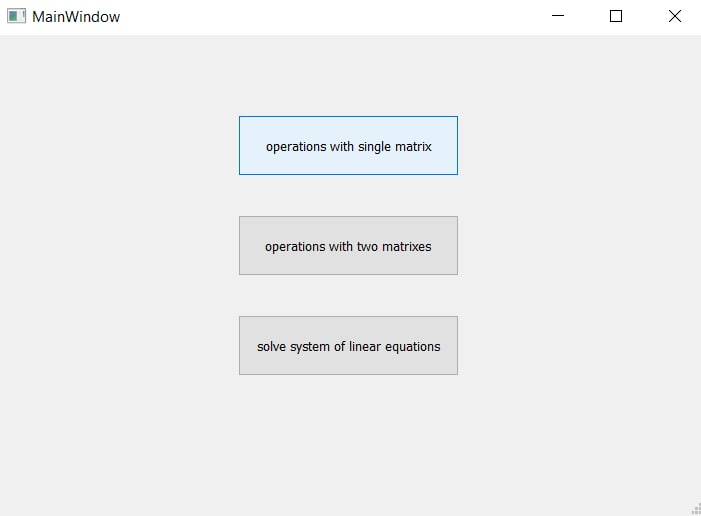

### Briefly about each part:

1. window for the 1st part:

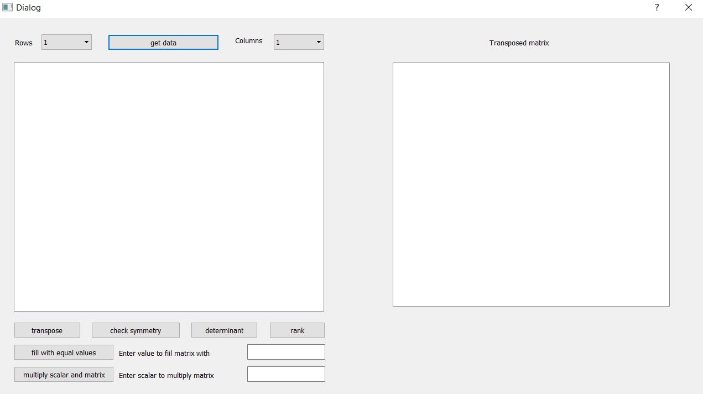

2. window for the 2nd part:

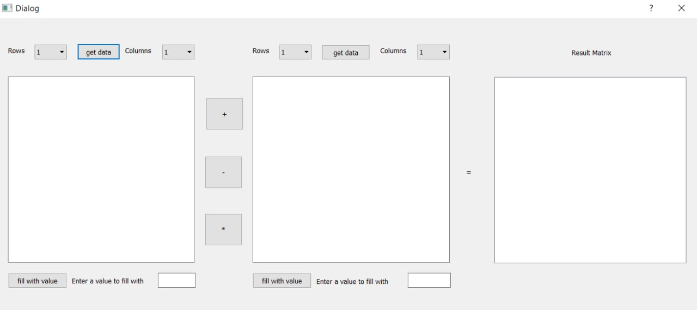

3. window for the 3rd part:

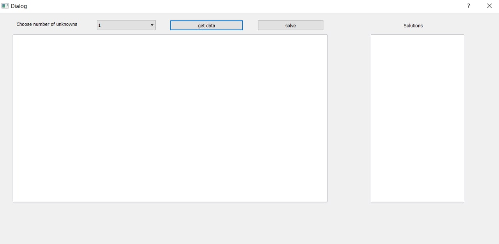

## Time complexity of basic functions ##
| Function | Definition | Time Complexity |
| --- | --- | --- |
| `operator+=(const Matrix& m)` | add two matrixes | O(N^2) |
| `operator-=(const Matrix& m)` | subtract two matrixes | O(N^2) |
| `operator*=(const Matrix& m)` | multiply two matrixes | O(N^3) |
| `operator*=(const double& scalar)` | multiply matrix by scalar | O(N^2) |
| `fill(const double& value)` | fill matrix with value | O(N^2) |
| `findDeterminant()` | calculate matrix determinant | O(N^3) |
| `findRank()` | calculate matrix rank | O(N^3) |
| `transpose()` | transpose matrix | O(N^2) |
| `checkIfSymmetrical()` | check matrix symmetry | O(N^2) |
| `transformMatrix()` | transform matrix to reduced row echelon form (diagonal view) | O(N^3) |

## Description of the app's work ##
 * ### 1st part:
   * calculate determinant:
   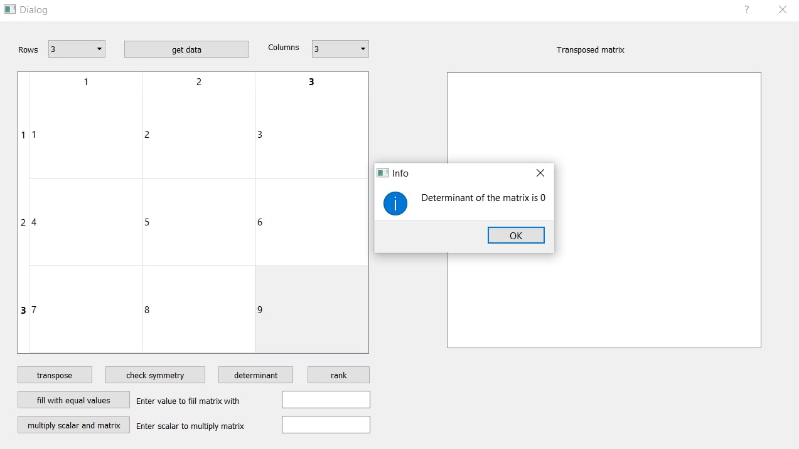
   
   * calculate rank:
   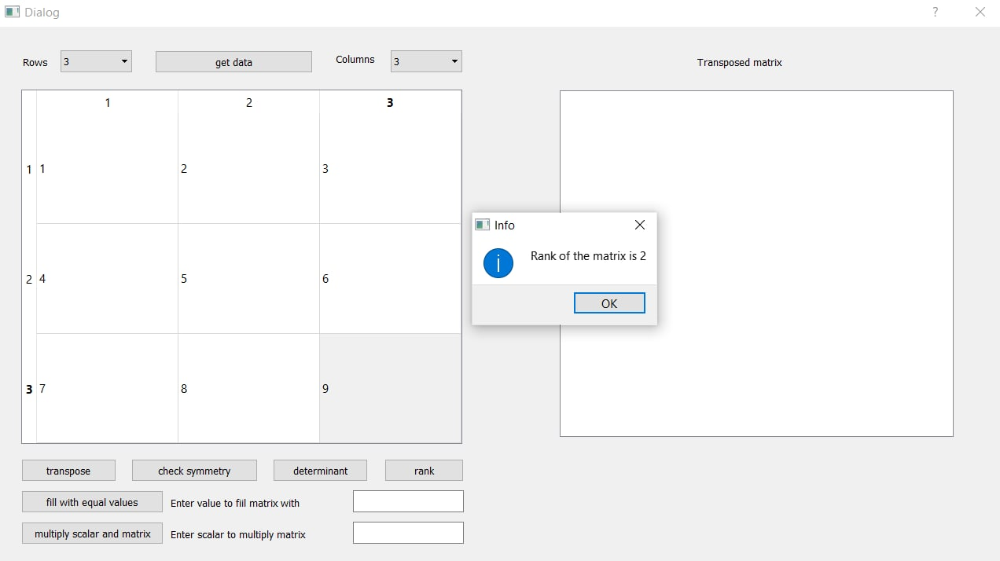
   
   * check symmetry of the matrix:
   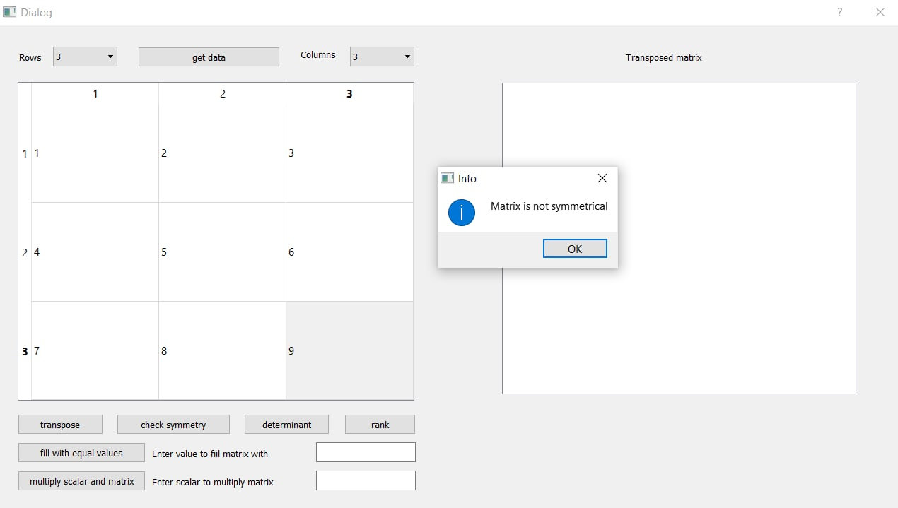
   
   * transpose matrix:
   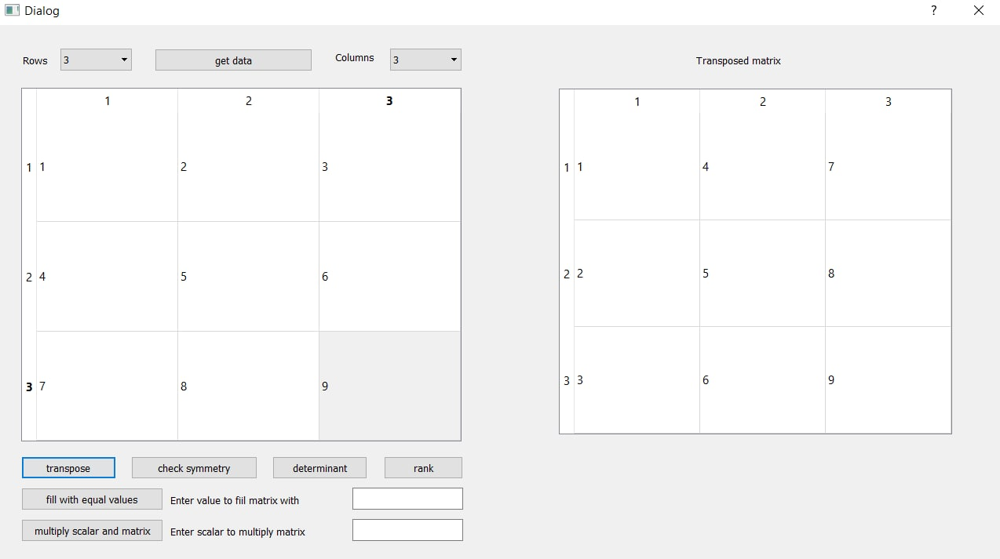
   
   * multiply matrix by scalar:
   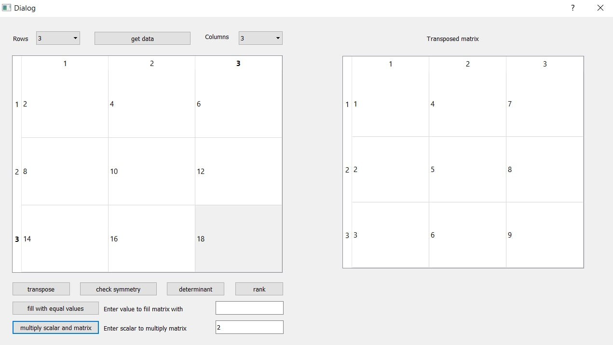
   
   * fill the matrix with equal values:
 
   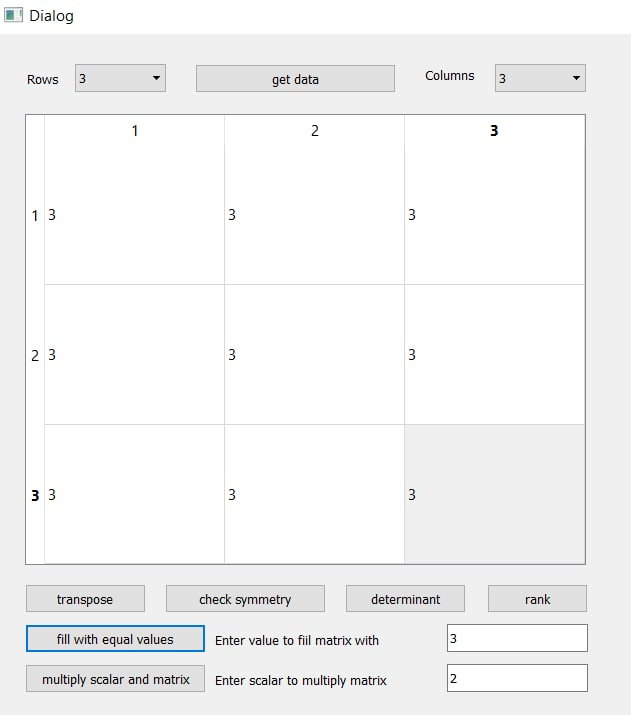
   
 * ### 2nd part:
   * addition:
   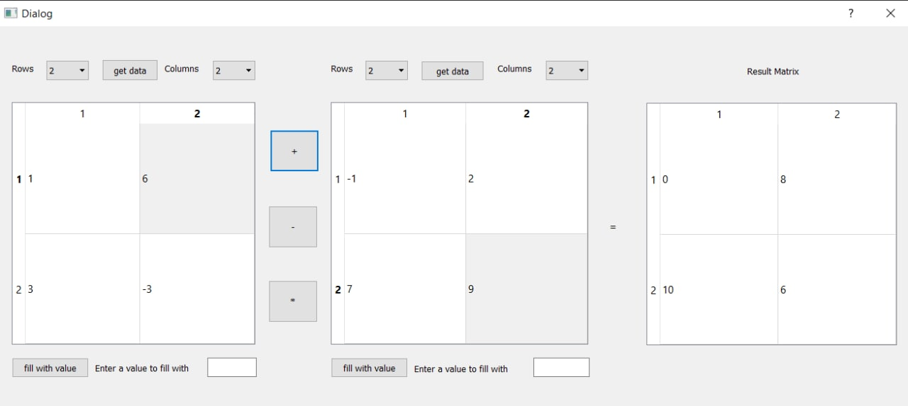
   
   * subtraction:
   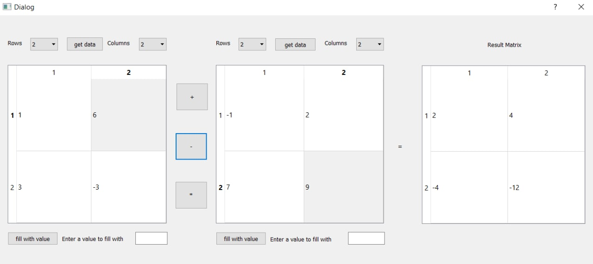
   
   * multiplication:
   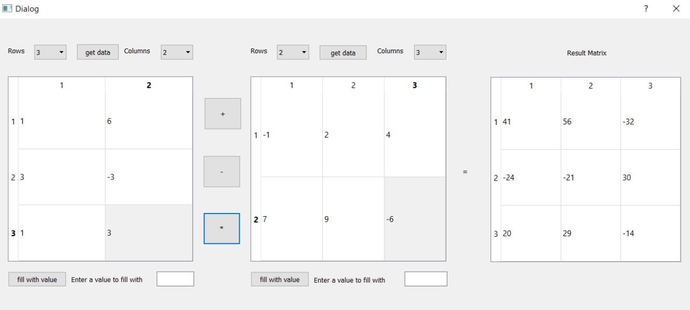
   
 * ### 3rd part:
   * example 1:
   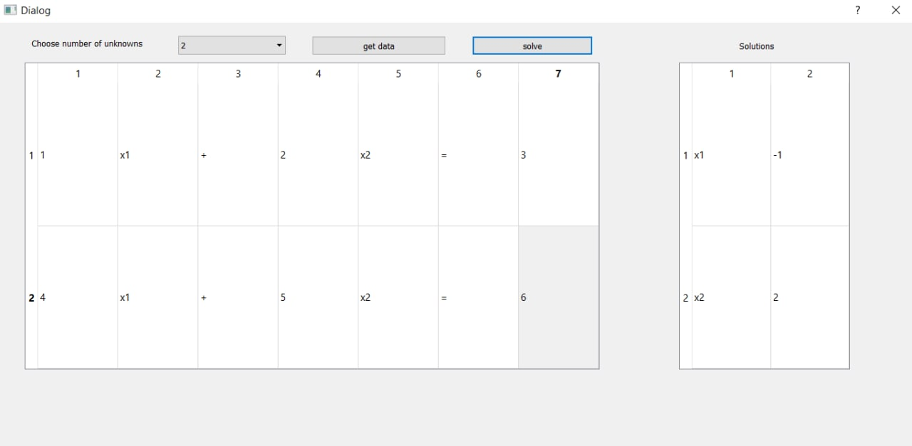
   
   * example 2:
   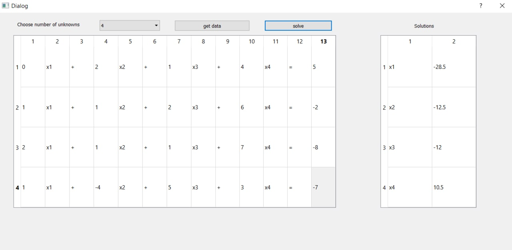
 
## Motivation ##
A few reasons of creating this app:
 * learn more about linear algebra, especially matrixes.
 * improve skills in work with QT
 * have an experience of creating a bit serious app.
 * pass exam automatically :)

## License ##
This project is licensed under MIT License.
